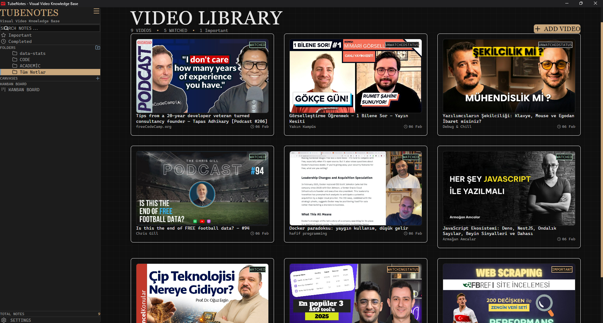
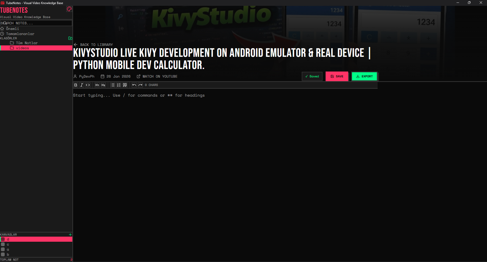

# TubeNotes - Visuelle Video-Wissensdatenbank


<div align="center">

<table>
  <tr>
    <td width="33%">
      
      <p align="center"><em>Videobibliothek</em></p>
    </td>
    <td width="33%">
      
      <p align="center"><em>Canvas-Modus - Visuelles Notieren</em></p>
    </td>
    <td width="33%">
      
      <p align="center"><em>Kanban-Aufgabenmodus</em></p>
    </td>
  </tr>
</table>

</div>

---

TubeNotes ist ein modernes visuelles Wissensmanagementsystem für YouTube-Videos. Machen Sie sich Videonotizen, visualisieren Sie Ihre Ideen auf einer unendlichen Leinwand, zeichnen Sie Formen, verwalten Sie Ihre Kanban-Aufgaben und fügen Sie Markdown-Notizen hinzu. Verfügbar als Desktop-Anwendung (Windows, macOS, Linux).

## Schnellstart

- Schritt 1: Gehen Sie zur [Releases](https://github.com/orgofjs/tubenotes-desktop/releases)-Seite.
- Schritt 2: Laden Sie die neueste Version herunter.
- Schritt 3: Installieren und mit dem Notieren beginnen!

### Hauptfunktionen

- Kanban-Aufgabenmodus
- Canvas-Modus
- YouTube-Videonotizen
- Organisationssystem
- Theme-Unterstützung
- Suche & Filterung
- Lokale Speicherung

### Technologien

| Kategorie | Technologie |
|-----------|-------------|
| Framework | Next.js 16.1.6 (App Router, Turbopack) |
| Desktop | Electron 40.0.0 + electron-builder |
| Datenbank | SQLite (better-sqlite3 12.6.2) |
| ORM | Prisma 6.19.2 (Schema-Definition) |
| Sprache | TypeScript 5 |
| Styling | Tailwind CSS 4 |
| Canvas | @xyflow/react 12.10.0 (React Flow) |
| Editor (Notizen) | Tiptap 3.15.3 (StarterKit, Link, Placeholder, CharacterCount) |
| Editor (Markdown) | CodeMirror 4.25.4 (@uiw/react-codemirror) |
| Animation | Framer Motion 12.26.2 |
| Icons | Lucide React 0.562.0 |
| Datum | date-fns 4.1.0 |
| PWA | @ducanh2912/next-pwa 10.2.9 |

- PWA ist standardmäßig deaktiviert; um es zu aktivieren, nehmen Sie die folgende Änderung in der Datei `next.config.ts` vor:

```js
// Zeile 32-34

// (löschen)
withPWA({
  dest: "public",
  disable: true,
  register: false,
})

// (hinzufügen)
withPWA({
  dest: "public",
  disable: process.env.NODE_ENV === "development",
  register: true,
})
```

### Systemanforderungen

**Kompilierte Anwendung**
- Windows 10+ (64-Bit)
- macOS 10.13+
- Linux: Ubuntu 18.04+, Fedora 32+, Debian 10+
- RAM: -
- Festplatte: 500MB freier Speicherplatz

**Entwicklung**
- Node.js 18.x+
- npm 9.x+
- Git

### Installation

```bash
# Repository klonen
git clone https://github.com/orgofjs/tubenotes-desktop.git

# Abhängigkeiten installieren
npm install

# Entwicklung für Desktop
npm run electron-dev

# Build für Windows
npm run build-win

# Build für macOS
npm run build-mac

# Build für Linux
npm run build-linux
```

### Konfiguration

**Theme-Anpassung**

Bearbeiten Sie `app/globals.css`:

```css
:root[data-theme="dark"] {
  --color-bg: #0a0a0a;
  --color-primary: #ff0000;
}
```

**Datenspeicherort**
- Windows: `%APPDATA%/tubenotes/tubenotes.db` (SQLite)
- macOS: `~/Library/Application Support/tubenotes/tubenotes.db`
- Linux: `~/.config/tubenotes/tubenotes.db`

### Lizenz

Apache 2.0 Lizenz - siehe [LICENSE](../LICENSE)-Datei.

---

<div align="center">
  <p>Erstellt von <a href="https://github.com/orgofjs">orgofjs</a></p>
  <p>
    <a href="https://github.com/orgofjs/tubenotes/stargazers">Stern geben</a> |
    <a href="https://github.com/orgofjs/tubenotes/issues">Fehler melden</a> |
    <a href="https://github.com/orgofjs/tubenotes/issues">Funktion anfragen</a>
  </p>
</div>
